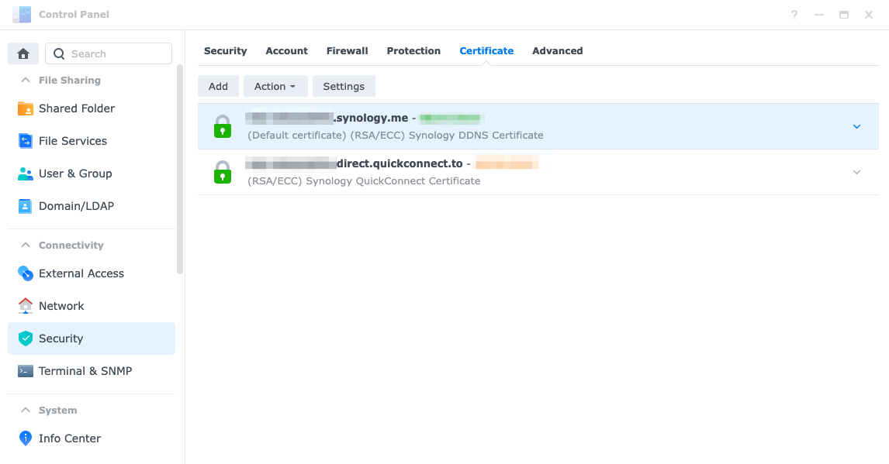

> A quick how-to to setup a CA on your Synology NAS and sign the DSM login page

This guide will help setting up the HTTPS connection for the Synology DSM in your home network when you are using your own DNS (e.g. PiHole). It's not really mandatory, but if you are like me, knowing that your traffic is wildly travelling without encryption, even if in your home network, might be unsettling.

The process is fairly straightforward, but there are a couple of pitfalls here & there, and it's useful to have a quick guide just to recap the required steps.

In this guide we are not going to configure an ACME server or anything like that, but rather an offline container which just signs URLs. If the container dies, HTTPS will still work. If the NAS gets disconnected, HTTPS will still work. It's just the simplest, so we are not leveraging the full capabilities of the Certificate Authority, but just going for a basic configuration.

Before starting
---------------
This guide need you to have basic proficiency in a couple of areas:
 - Basic bash, ssh, https knowledge
 - A DNS already set up
 - A Synology NAS which supports Docker


What are we going to do
-----------------------
In this guide we will set up our own Certificate Authority on Docker (using Synology app, no CLI required) and use it to sign your pages (well, the DSM login page at least). 

In my research, I bumped into [step-ca](https://smallstep.com/docs/step-ca/) and I find it enough for my needs, it also came with a [step-ca docker guide](https://hub.docker.com/r/smallstep/step-ca), so give it a read before starting!

This is the overview of the steps:
 1) Bootstrap the `step-ca` container, and **before doing anything else**, take note of the admin password
 2) Configure the container. It's important to properly configure the `ca.json` to avoid the 24 hours validity limit.
 3) Create the certificates (double check you are in the proper folder)
 4) Import the certificates in DSM and **update the 'system default' item under settings**
 5) Install `root_ca.crt` on all the devices in your network
 6) Profit!


Step 1 - Bootstrap your `step-ca` container
-------------------------------------------

Just pull the `smallstep/step-ca` latest image (I prefer to go by tag, as per today latest is `0.24.1`):


It should all go well and you should see the image ready to be used:


Now that you downloaded the image, just double click to create a new container.

We are not really exposing the container, thus bridged network is just fine:


I also like to give the bare minimum in term of resources, and this seems enough to get the job done:


**As per [step-ca docker guide / Quickstart section](https://hub.docker.com/r/smallstep/step-ca)**, you need to pass the `DOCKER_STEPCA_INIT_NAME` and `DOCKER_STEPCA_INIT_DNS_NAMES` extra environemnt variables for it to setup automatically, therefore add them in the advanced settings:


There is no need to add any link, but I strongly recommend to mount the home folder somewhere on your NAS:


At the end of the setup, you can just run the container:


Given that the mounted volume has the right permissions, there should be no troubles:


Given that the mounted volume has the right permissions, there should be no troubles:


Now, **go in the logs and make a copy of the admin password**, because if it get lost you won't be able to recover it:


Well done, you have your Certificate Authority running! 🎊


Step 2 - Configure the container
--------------------------------

Before proceeding, I like to have a folder where my certificates can be found.

A simple new directory under `~/certs` will do (remember that we mounted the volume?):


As well, before proceeding, we need to edit the `~/config/ca.json` file in order to allow an expiration date up to one year (default is one day, a bit limiting).

Most probably you'll already have the `authority` property, but it will be missing `claims`. Add `maxTLSCertDuration` under `claims` as per snippet (8766 hours is one year, also note that the container doesn't come with `vim`, but rather with `vi`): 
```json
    ...
	"authority": {
		"claims": {
			"maxTLSCertDuration": "8766h"
		},
		"provisioners": [
			{
				"type": "JWK",
				"name": "admin",
				"key": {
    ...
```

If are curious, you can visit the [official documentation about ca.json](https://smallstep.com/docs/step-ca/configuration/index.html#example-configuration)

Once we finish our edits, we have to **reload the server** in order to read the new configuration. Since the PID of the process is usually one, a `kill -HUP 1` will do.

If you forgot any of the steps above, you'll get an error:
```
The request was forbidden by the certificate authority: requested duration of 8766h1m0s is more than the authorized maximum certificate duration of 24h1m0s.
```


Step 3 - Create the certificates
--------------------------------

The command to use is the following:
```
step ca certificate "your_nas_address.lan" your_nas_name.crt your_nas_name.key --ca-url https://localhost:9000 --root /home/step/certs/root_ca.crt --not-after 8766h
```

It's worth nothing that **both *your_nas_name.crt* and *your_nas_name.key* are output files** and they will be created in the current folder, therefore it's convenient to be under `~/cert/created`:


Assuming that you saved the password from step 1 and that you properly added the JSON configuration in step 2, you should now have your signed certificates.


Step 4 - Import the certificates in DSM
---------------------------------------

Before keep going, there is a sneaky intermediate step to accomplish:
 - From your container mounted volume, download the `certs/intermediate_ca.crt` and `cert/root_ca.crt` files
 - **Merge the content of the two together**, having `root_ca.crt` first.
   - For example, open an empty file, copy the content of `root_ca.crt ` first, copy the content of `intermediate_ca.crt` after, and call it **`root_and_intermediate_ca_chained.crt`**.

This step is required because your NAS doesn't know about your Certificate Authority, and passing the intermediate certificate alone might not be enough!

Since you are there, download your certificates too!

Now, open the Control Panel and go in the certificate page:


Click add, and just fill the fields accordingly:


Wait for it to finish, it might take a while (e.g. ~15 minutes), and it might even hang. If it hangs, wait for a bit and then just refresh and repeat.

If it all goes well, you should see your certificate in the list (I didn't have the patience to add another cert, so I just blurred my real one):


Now wait, **it's not finished**! Even if you set the certificate as your default one, it will still not work!

You now have to **enter the certificate Settings** and **change the System default** to your newly added certificate:


That's it for the NAS!


Step 5 - Configure the other devices in the network
---------------------------------------------------

Well, that changes case by case (Android, Windows, iOS, MacOS), but basically you have to import and trust the `cert/root_ca.crt` file in all your devices.


Step 6 - Profit
---------------

Here it goes, you should have the beloved lock in your browser now!


As well, quickconnect should also be still working using Let's Encrypt certificates (or whatever you configured).
